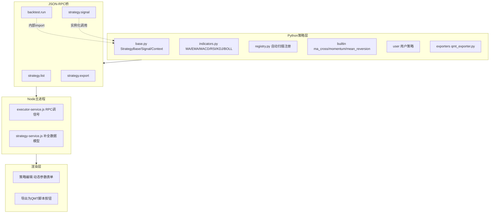

# 策略模块重构开发计划

> 日期：2026-07-18
> 目标：将策略模块重构为「统一、灵活、可跨平台导出」的事件驱动策略框架
> 前置基础：行情查询、策略 CRUD、回测引擎、模拟交易、执行器均已存在但分散

## 一、背景与核心设计决策

### 1.1 痛点（现状问题）

| 问题 | 现状 | 影响 |
|------|------|------|
| 策略逻辑双份 | Node 侧 ma_cross.js（实盘）+ Python 侧 backtest_engine.py（回测）手动同步 | 回测与实盘可能不一致 |
| 策略硬编码 | STRATEGY_MAP 写死 3 个策略，执行器 SIGNAL_FUNCTIONS 也写死 | 加策略要改框架代码 |
| 信号模型不一致 | 回测批量返回 [(date,action)]，实盘增量返回 {action} | 无法统一 |
| 数据模型缺字段 | 执行器用 symbols/schedule/risk，但 StrategyService 未持久化 | 重启后执行参数丢失 |
| 无法跨平台 | 策略只能在我们框架跑 | 不能导出到 QMT/PTRade |

### 1.2 已确认的核心设计决策（经讨论确认）

1. **策略统一到 Python**：信号计算全部在 bridge/strategies/，Node 侧通过 RPC 调用，删除 main/strategies/ma_cross.js
2. **事件驱动统一**：策略只写 on_bar 增量逻辑，回测引擎逐 bar 喂、实盘逐 bar 喂，**同一份代码两种用法**
3. **灵活可扩展**：策略基类 + params_schema + 自动注册，丢个 .py 到 data/strategies/user/ 即扩展，框架代码零修改
4. **吸收 QMT 设计精华**（参考 docs/api/QMT_API_Full.md）：
   - 增加 on_after_init（数据预热与初始化分离）
   - Signal.target_position 一等公民（对应 QMT order_target_percent）
   - 策略用面向对象 self._state 存跨 bar 状态（避开 QMT ContextInfo 逐 bar 回退坑）
   - 明确回测撮合规则（参考 QMT：限价单在 K 线高低点内成交）
5. **标准接口最大公约数**：Context 接口取各平台能力交集（get_bars/order_target_percent 等跨平台通用）
6. **QMT 导出器**：用「适配壳包装」模式，策略逻辑原样保留，生成单文件 QMT 脚本

### 1.3 与 QMT/xtquant 的边界（重要）

```
QMT 客户端平台 API（init/handlebar/ContextInfo）   <- 仅作设计参考，不依赖
    ↓ 借鉴思想
我们的策略框架（on_init/on_bar/Context）           <- 自己实现，本计划核心
    ↓ 调用行情/交易时才碰 xtquant
xtquant 库（xtdata/xttrader）                      <- Python 桥实际 import
    ↓ 本地 socket
miniQMT 服务进程                                   <- 真实数据/交易后端（复用，不重写）
```

**我们不实现 QMT，只实现「策略框架」这一薄层**。行情和交易复用 miniQMT。

## 二、架构总览



## 三、分阶段开发计划

### Phase 1：策略内核（Python 基础）

**目标**：搭好策略基类、指标库、注册机制，迁移现有 3 个策略为基类实现。

**任务**：
- 新建 bridge/strategies/__init__.py
- 新建 bridge/strategies/base.py：StrategyBase + Signal + Context
- 新建 bridge/strategies/indicators.py：MA/EMA/MACD/RSI/KDJ/BOLL（从 backtest_engine.py 抽出 sma 并扩展）
- 新建 bridge/strategies/registry.py：扫描 builtin/ 和 data/strategies/user/，自动 import 注册
- 新建 bridge/strategies/builtin/__init__.py
- 新建 bridge/strategies/builtin/ma_cross.py：迁移为 on_bar 增量模式
- 新建 bridge/strategies/builtin/momentum.py
- 新建 bridge/strategies/builtin/mean_reversion.py

**关键接口定义**：

```python
# Signal 模型
@dataclass
class Signal:
    action: str                              # "buy"|"sell"|"hold"
    reason: str = ""
    strength: float = 1.0                    # 信号强度[0,1]
    target_position: Optional[float] = None  # 目标仓位[0,1]，对应 QMT order_target_percent
    indicators: dict = field(default_factory=dict)

# Context 上下文（跨平台最大公约数）
class Context:
    bars: list; position; account; indicators
    is_backtest: bool; barpos: int; symbol: str
    def get_bars(self, symbol, count, period="1d"): ...
    def order_target_percent(self, symbol, percent): ...
    def order_target_value(self, symbol, value): ...
    def order_shares(self, symbol, shares): ...
    def cancel_order(self, order_id): ...
    def get_position(self, symbol): ...
    def get_account(self): ...

# 策略基类
class StrategyBase:
    name, display_name, description, version, params_schema, trigger_mode
    def __init__(self, params=None): self.params = ...; self._state = {}
    def on_init(self, ctx): ...           # 对应 QMT init
    def on_after_init(self, ctx): ...     # 对应 QMT after_init（数据预热）
    def on_bar(self, bar, ctx): ...       # 对应 QMT handlebar（必须实现）
    def on_tick(self, tick, ctx): ...     # 对应 QMT subscribe callback
    def on_stop(self, ctx): ...           # 对应 QMT stop
```

**验收**：
- [ ] python -c "from bridge.strategies.registry import load_all, get; load_all(); print(get('ma_cross'))" 能列出策略
- [ ] 实例化 ma_cross，喂入测试 bars，on_bar 返回正确信号
- [ ] 3 个内置策略均通过单元验证（信号逻辑与原 backtest_engine 一致）

---

### Phase 2：回测引擎改造（统一关键）

**目标**：回测引擎删除硬编码 STRATEGY_MAP，改为通过 registry 加载策略类，逐 bar 调用 on_bar。

**任务**：
- bridge/backtest_engine.py 改造：
  - 删除 strategy_ma_cross/strategy_momentum/strategy_mean_reversion/sma/STRATEGY_MAP
  - run_backtest 改为：strat = registry.get(type)(params); strat.on_init(ctx); for bar in bars: signal = strat.on_bar(bar, ctx)
  - 撮合逻辑支持 target_position（调仓至目标比例）
  - 改进撮合规则：限价单在 K 线高低点内按指定价成交，超范围按收盘价（参考 QMT 第 12 节）
  - 保留绩效指标计算逻辑不变
- 回测引擎启动时调用 registry.load_all()

**验收**：
- [ ] ma_cross 回测结果（总收益/最大回撤/夏普）与改造前一致（容差 0.01%）
- [ ] momentum/mean_reversion 回测同样对齐
- [ ] 新策略（丢 .py 到 user/）无需改回测引擎即可回测

---

### Phase 3：Python 桥 RPC 扩展

**目标**：在 qmt_server.py 暴露 strategy.* 方法，供 Node 侧调用。

**任务**：
- bridge/qmt_server.py 新增方法：
  - strategy.list：返回 [{name, display_name, description, params_schema, trigger_mode}]（供 UI 渲染参数表单）
  - strategy.signal：入参 {type, bars, params, symbol}，实例化策略，逐 bar 喂到最后一根，返回最后 signal（实盘用）
  - strategy.validate（可选）：校验参数合法性
- 启动时 registry.load_all() 预加载

**验收**：
- [ ] Node 侧通过 stdio 发 strategy.list 能拿到策略元数据 JSON
- [ ] 发 strategy.signal 能拿到正确信号
- [ ] 未知策略类型返回明确错误

---

### Phase 4：Node 侧 + 执行器改造

**目标**：执行器改用 RPC 调信号，删除 Node 侧策略代码，补全策略数据模型。

**任务**：
- main/datasources/qmt.js 或新建 main/datasources/strategy-bridge.js：封装 strategy.list/signal/export 的 RPC 调用
- main/services/executor-service.js 改造：
  - 删除 SIGNAL_FUNCTIONS 硬编码和 require("../strategies/ma_cross")
  - tick() 中改为调用 strategy.signal RPC
  - 支持 target_position 信号（调仓至比例，调 trade-service）
- main/services/strategy-service.js 补全数据模型字段：
  - create/update 增加 symbols、schedule、risk、runtime、params（已有）的持久化
- main/strategies/ma_cross.js 标记 deprecated（先保留，后续删除）
- main/ipc/index.js + preload.js 暴露 strategy.list（让前端能拉可用策略类型）

**验收**：
- [ ] 执行器启动策略后，tick 能通过 RPC 算信号并下单（mock 交易模式）
- [ ] 策略保存后重启应用，symbols/schedule/risk 等字段不丢失
- [ ] 前端能通过 facade 拿到可用策略类型列表

---

### Phase 5：QMT 导出器

**目标**：策略能一键导出为可在 QMT 客户端运行的单文件脚本。

**任务**：
- 新建 bridge/strategies/exporters/__init__.py
- 新建 bridge/strategies/exporters/base.py：ExporterBase 基类（定义导出契约）
- 新建 bridge/strategies/exporters/qmt_exporter.py：
  - 适配壳模板：_Ctx 适配类（ContextInfo -> 我们的 Context）+ init/handlebar/stop 生命周期壳
  - 策略源码嵌入：inspect.getsource(strategy_class) 原样保留
  - 参数注入：从 params_schema 默认值生成 g.xxx
  - 编码处理：#coding:gbk，中文转 ascii 安全写法
  - 下单函数差异处理：ctx.do_back_test 判断回测用 order_target_percent、实盘用 passorder
  - is_last_bar() 过滤、set_account 订阅自动添加
- qmt_server.py 新增 strategy.export 方法：入参 {type, platform:"qmt"}，返回脚本字符串
- Node 侧 IPC 暴露 strategy.export

**验收**：
- [ ] 导出的脚本含 #coding:gbk，语法正确
- [ ] 导出脚本含策略类原码 + 适配壳 + QMT 生命周期壳
- [ ] 回测下单用 order_target_percent，实盘用 passorder（根据 do_back_test）
- [ ] （可选，需 QMT 环境）粘到 QMT 客户端能运行

---

### Phase 6：UI 集成

**目标**：前端支持新策略框架的完整闭环。

**任务**：
- renderer/js/viewmodels/strategy-viewmodel.js 增强：
  - 加载策略类型列表（facade.strategy.list）
  - 根据选中类型的 params_schema 动态生成参数表单
- renderer/js/views/strategy-view.js 增强：
  - 动态参数表单渲染（int/float/string/select 类型）
  - 「导出为 QMT 脚本」按钮 -> 调 facade.strategy.export -> 下载/展示脚本
  - 策略编辑时选择 trigger_mode（bar/tick/schedule）
- preload.js 暴露 facade.strategy.list/export

**验收**：
- [ ] 新建策略时，选类型后参数表单自动变化
- [ ] 导出按钮能生成脚本并下载/预览
- [ ] 完整闭环：建策略->调参->回测->（mock）实盘执行->导出 QMT

---

### Phase 7：知识库文档更新

**目标**：同步更新文档，保持知识库与代码一致。

**任务**：
- 新建 docs/.ai/knowledge-library/03-strategy/0301-strategy-framework.md：策略框架架构
- 新建 docs/.ai/knowledge-library/03-strategy/0302-strategy-dev-guide.md：策略开发指南（如何写自定义策略）
- 新建 docs/.ai/knowledge-library/03-strategy/0303-export-guide.md：导出 QMT 指南
- 更新 AGENTS.md / CLAUDE.md 中策略相关章节
- 更新 bridge/README.md

**验收**：
- [ ] 知识库覆盖策略框架设计、开发、导出三方面
- [ ] AGENTS.md 的项目结构/架构描述与重构后一致

## 四、数据模型（重构后）

### 4.1 策略 JSON（data/strategies/{id}.json）

```json
{
  "id": "st_xxx",
  "name": "双均线策略",
  "description": "MA5 上穿 MA20 买入",
  "type": "ma_cross",
  "params": {"fast": 5, "slow": 20},
  "symbols": ["sh600519"],
  "schedule": {"intervalMs": 60000, "mode": "timer"},
  "risk": {
    "stopLoss": 0.05,
    "stopProfit": 0.15,
    "maxPositionRatio": 0.3,
    "maxOrderAmount": 500000
  },
  "runtime": {"triggerMode": "bar"},
  "status": "draft|active|running|stopped|error",
  "createdAt": "ISO",
  "updatedAt": "ISO"
}
```

### 4.2 策略类元数据（registry 返回）

```json
{
  "name": "ma_cross",
  "display_name": "双均线交叉",
  "description": "快线上穿慢线买入，下穿卖出",
  "version": "1.0",
  "trigger_mode": "bar",
  "params_schema": [
    {"key":"fast","type":"int","default":5,"min":1,"max":60,"label":"快线周期"},
    {"key":"slow","type":"int","default":20,"min":2,"max":250,"label":"慢线周期"}
  ]
}
```

## 五、默认假设（未明确确认的点）

| 决策点 | 采取方案 | 理由 |
|--------|----------|------|
| 用户策略存放位置 | data/strategies/user/ | 与数据放一起，用户可见可备份 |
| 热加载 vs 重启加载 | 先重启加载 | 简单可靠，热加载后续增强 |
| target_position 实现 | 接口先留，Phase 2/4 实现 | 避免过度设计，但预留扩展 |
| Node 侧 ma_cross.js | 标记 deprecated 保留 | 平滑过渡，验证后删除 |
| 撮合规则改进 | Phase 2 顺带做 | 参考QMT，提升回测真实度 |

## 六、风险与注意事项

1. **回测结果对齐**：Phase 2 改造后必须保证 ma_cross 等策略回测结果与改造前一致（容差 0.01%），否则破坏既有可信度。
2. **编码问题**：QMT 要求 #coding:gbk，导出器要正确处理中文（策略描述、指标名），建议 ascii 安全写法。
3. **ContextInfo 逐 bar 回退**：QMT 文档 3.5 警告 ContextInfo 不宜存跨 bar 状态。导出器的适配壳用全局 g 而非 ContextInfo 存状态。
4. **回测/实盘下单函数差异**：QMT 回测用 order_target_percent 等专用函数，实盘用 passorder，导出壳需按 do_back_test 分支。
5. **xtquant 路径依赖**：策略框架本身不依赖 xtquant，但 strategy.signal RPC 需要 qmt_server.py 运行（即 Python 桥在跑）。
6. **多策略并行**：执行器现有逻辑支持多策略，导出器导出的是单策略脚本，多策略在 QMT 里需分别部署。

## 七、实施顺序与依赖

```
Phase 1 (策略内核)
  └─> Phase 2 (回测改造) ──> Phase 3 (RPC扩展) ──> Phase 4 (Node+执行器)
                                                        │
                                                        └─> Phase 6 (UI集成)
Phase 5 (QMT导出器)  <── 可与 Phase 3/4 并行（依赖 Phase 1）
  │
  └─> Phase 6 (UI 集成导出按钮)
Phase 7 (文档) 贯穿，每个 Phase 完成后同步对应文档
```

- Phase 1 是地基，必须先完成
- Phase 2 依赖 Phase 1（要用基类）
- Phase 3 依赖 Phase 1（RPC 暴露基类）
- Phase 4 依赖 Phase 3（Node 调 RPC）
- Phase 5 依赖 Phase 1（导出策略类），可与 Phase 3/4 并行
- Phase 6 依赖 Phase 4 + Phase 5
- Phase 7 贯穿全程

每个 Phase 完成后验证可运行，不留半成品。
